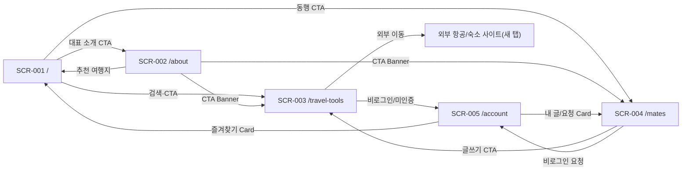

# Free Traveler — UI Contract (Next.js App Router)

**Document ID:** UI-CONTRACT-001
**기반 문서:** `docs/03_UI_COVERAGE_ANALYSIS.md`, `docs/04_UIUX_PLAN.md`, `docs/STITCH_VALIDATION_REPORT.md`, `design-reference/D-001/DESIGN.md`
**대응 데이터:** `design-reference/SCREEN_ROUTE_CONTRACT.json`
**작성일:** 2026-09-15
**상태:** Implementation Contract (D-001 LOCKED 기준)

---

## 0. 목적과 범위

이 문서는 승인된 5개 Screen(SCR-001~SCR-005, Stitch에서 검증 완료)을 Next.js App Router 구현이 그대로 따라야 할 계약으로 변환한다. 시각적 세부 규칙(색상·타이포그래피·컴포넌트 스펙)은 `design-reference/D-001/DESIGN.md`를 그대로 참조하며, 이 문서는 **Screen ↔ Route ↔ Page Entry ↔ 영역/컴포넌트/상태/행동/이동** 대응만 고정한다. 코드는 포함하지 않는다.

### 핵심(Core) 4 / 보조(Supporting) 1 구분

| 구분 | Screen |
|---|---|
| 핵심 1 | SCR-001 `/` — 여행지 탐색·안전정보 진입점 |
| 핵심 2 | SCR-003 `/travel-tools` — 항공·숙소 조건 정리, 동행 모집글 작성 |
| 핵심 3 | SCR-004 `/mates` — 동행 검색·참가 요청·신고·차단 |
| 핵심 4 | SCR-005 `/account` — 인증, 내 활동 관리, 관리자 신고·URL 설정(쓰기 액션의 전제 조건) |
| 보조 1 | SCR-002 `/about` — 대표 소개(신뢰·브랜딩 콘텐츠, 전환 플로우 아님) |

---

## 1. SCR-001 `/` 메인

| 항목 | 내용 |
|---|---|
| **Screen ID** | SCR-001 |
| **Route** | `/` |
| **Page Entry** | `src/app/page.tsx` |
| **분류** | 핵심 |
| **Stitch 승인 ID** | `2a0bea03968b44548ab4995d295c5a4d` (Desktop) / `eec6035a9fef48f5a2f18462a5849d15` (Mobile 390px) |

**영역 순서** (Header 공통 → 7 Section → Footer 공통)
1. Header(공통)
2. Hero — 검색창 + `/travel-tools` CTA
3. 국내 인기 여행지 Card Grid 6개
4. 해외 인기 여행지 Card Grid 6개(안전정보 배지)
5. 여행 동기·테마 Chip 6개
6. 국가별 주의사항 Card 6개 + 안전정보 Drawer 연결
7. 최근 동행글 3개 또는 완성형 Empty State
8. free_traveler 요약(50+ Trips/30+ Countries) + `/about` CTA
9. Footer(공통)
10. (오버레이) 여행지 상세 Drawer/Modal — 안전정보 하위 탭 포함

**주요 Component**: `search-bar-pill`, `destination-card`×12, `chip`(테마 6), `badge-warning`(stale), `badge-danger`(중대 경보), `drawer`(여행지 상세+안전정보), `button-primary`(CTA 다수), `top-nav`, `footer-light`

**상태**: Loading(카드 스켈레톤), Success, Empty(필터 결과 0건 / 동행글 0건 — 완성형 Empty State), Error(Drawer 데이터 로드 실패·안전정보 원문 링크 실패)

**사용자 행동**: 여행지 검색·필터, Card 선택 → 상세 Drawer 열기, 안전정보 하위 탭 확인·MOFA 원문 새 탭 이동, 테마 Chip 선택, 즐겨찾기 토글, CTA 클릭

**다른 화면으로의 이동**: `/travel-tools`(검색/CTA), `/mates`(동행 CTA), `/about`(대표소개 CTA). 여행지·안전정보 상세는 **같은 화면의 Drawer/Modal**로 열리며 라우트 이동이 아니다.

**Desktop·Mobile 규칙**: Hero 높이 540px(D-001 15절 범위 내), Desktop 1440px에서 Hero 아래 Section 2 상단이 즉시 보임. Card Grid Desktop 3~4열 / Mobile 1열(가로 스크롤 허용). Mobile 390px 승인본 존재.

**금지 기능**: 여행지 목록 내부 통합검색(안전정보까지 포함하는 검색)은 만들지 않음(REQ-FUNC-067 EXCLUDED), 여행지 카드에 실시간 가격·별점·광고 배지 금지, 예약/결제 CTA 금지.

---

## 2. SCR-002 `/about` 대표 소개

| 항목 | 내용 |
|---|---|
| **Screen ID** | SCR-002 |
| **Route** | `/about` |
| **Page Entry** | `src/app/about/page.tsx` |
| **분류** | 보조 |
| **Stitch 승인 ID** | `86756e99f46e4d06b68d1ab22cdc5327` (Desktop) — Mobile 변형 이번 승인 범위 아님 |

**영역 순서**
1. Header(공통)
2. Profile Hero(대표 사진 + 소개 문장)
3. 여행 지표(50+ Trips/30+ Countries 포함 카드 3개)
4. 자기소개·철학 2~4문단(좌우 분할)
5. 여행 Timeline 6개 이상
6. 방문 국가 권역별 Chip/목록 30개
7. Gallery 사진 8개 이상
8. 기억에 남는 여행지 4개 + `/travel-tools`·`/mates` CTA
9. Footer(공통)

**주요 Component**: 지표 카드, `chip`(방문국가), Gallery Card Grid, `destination-card`(추천 4), `button-primary`/`button-secondary`(CTA 2개), `top-nav`, `footer-light`

**상태**: Loading(Hero 이미지 블록 스켈레톤), Success, Error(이미지 로드 실패 시 중립 플레이스홀더 + alt 유지). Empty·Unauthorized 상태는 정의하지 않음(정적 콘텐츠).

**사용자 행동**: 스크롤 열람, 추천 여행지 Card 선택, 하단 CTA 클릭

**다른 화면으로의 이동**: 추천 여행지 Card → **SCR-001의 상세 Drawer**(SCR-001로 이동 후 Drawer 오픈), CTA Banner → `/travel-tools`, `/mates`

**Desktop·Mobile 규칙**: Hero는 화면 전체 높이를 차지하지 않고 D-001 15절 범위(480~620px) 내로 제한. Card Grid Desktop 3~4열 / Mobile 1열. Mobile 변형은 이번 승인 대상 아님 — 구현 시 D-001 규칙을 동일 적용해 별도 검증 필요.

**금지 기능**: 방문 국가/타임라인 데이터의 CMS 편집 UI 없음(정적 데이터, REQ-FUNC-072 EXCLUDED), 이미지 라이선스 입력 폼 없음(alt 텍스트만 사용), 팬레터/댓글/리뷰 UI 없음.

---

## 3. SCR-003 `/travel-tools` 통합 여행 준비

| 항목 | 내용 |
|---|---|
| **Screen ID** | SCR-003 |
| **Route** | `/travel-tools` |
| **Page Entry** | `src/app/travel-tools/page.tsx` |
| **분류** | 핵심 |
| **Stitch 승인 ID** | `ed9175c4fae84c29976b5dee948f82a7` (Desktop) / `f290caa5ed354c70bde4b18f60be16d6` (Mobile 390px) |

**영역 순서**
1. Header(공통)
2. Intro(이용 순서 3단계 요약)
3. 탭(항공편 찾기 / 숙소 찾기 / 동행 구하기 — 3개 모두 필수)
4. 여행정보 입력 Form(국가·지역·출발일·귀국일, 탭별 필드 재사용)
5. 입력 요약 + 외부 이동 Action Card
6. 찾기 Tip 3개(입력값 비전달 고지 포함)
7. 동행 작성 Form 또는 로그인 안내 + 안전 안내(동행 탭)
8. Footer(공통)

**주요 Component**: `tab-active`/`tab-inactive`(3개), `text-input`×4, `button-primary`(다음/외부이동/저장), `badge`류, 안전수칙 동의 체크박스(동행 탭), `top-nav`, `footer-light`

**상태**: Loading(외부 이동 버튼 클릭 직후), Success(폼 검증 통과 → 요약 표시, 동행글 제출 완료), Error(날짜 검증 실패, 외부 URL 미설정/허용목록 밖, 공개 연락처 탐지 차단), Unauthorized(동행 탭에서 비로그인/성인확인 미완료 시 Form 대신 안내 카드)

**사용자 행동**: 탭 전환(항공/숙소/동행, **탭별 입력·검증·완료 상태 독립 유지**), 국가·지역·날짜 입력, 요약 확인, "항공편/호텔 보러 가기" 클릭(새 탭), 동행글 작성·안전수칙 동의·제출

**다른 화면으로의 이동**: 외부 새 탭(Google Flights/Booking.com — `noopener,noreferrer`), `/account`(동행 탭에서 비로그인·성인확인 미완료 시), 동행글 제출 완료 후 `/mates`로 이동 유도(안내 CTA)

**Desktop·Mobile 규칙**: Hero 없음(Intro로 시작), Section 상하 여백 Desktop 64~96px / Mobile 40~64px. Mobile은 탭을 가로 스크롤, Form 필드는 세로 스택 + 하단 고정 CTA. Mobile 390px 승인본 존재.

**금지 기능**: 항공·숙소 검색 결과·가격 비교·실시간 가격 표시 금지(REQ-FUNC 외부연결 원칙), 입력값의 서버 DB·로그·URL 쿼리 저장 금지(REQ-NF-017), 예약/결제 버튼 금지, 관리자 편집 UI 없음(외부 URL 설정은 SCR-005 관리자 탭에서만).

---

## 4. SCR-004 `/mates` 동행 조회

| 항목 | 내용 |
|---|---|
| **Screen ID** | SCR-004 |
| **Route** | `/mates` |
| **Page Entry** | `src/app/mates/page.tsx` |
| **분류** | 핵심 |
| **Stitch 승인 ID** | `6e4e82f9d4724e21b40b73717526ba4f` (Desktop) — Mobile 변형 이번 승인 범위 아님 |

**영역 순서**
1. Header(공통)
2. Intro + 글 작성 CTA
3. Filter + 결과 요약
4. 동행글 Card 목록(데이터 있으면 최대 8개 우선 노출, 없으면 완성형 Empty State)
5. 상세 영역(Desktop 목록+상세 좌우 분할 / Mobile 목록→상세 Drawer)
6. 신청 방법 3단계 안내
7. 안전한 만남·신고·차단 안내 + `/travel-tools` CTA
8. Footer(공통)

**주요 Component**: Filter 드롭다운/`chip`, `mate-post-card`×N(모집중=`badge-success`, 마감=`badge-neutral`), 참가 요청 폼(비공개 메시지), 승인/거절 컨트롤(작성자 뷰), 신고·차단 버튼, `drawer`(Mobile 상세)

**상태**: Loading(목록/상세 스켈레톤), Success, Empty(필터 결과 0건 — 조건 초기화+작성 CTA+이용방법 포함 완성형), Error(중복 참가 요청, 신고 제출 실패), Unauthorized(비로그인 참가 요청·글쓰기 시도 시 안내 카드)

**사용자 행동**: 필터 조건 설정, Card 선택 → 상세 열람, 참가 요청 메시지 제출, (작성자) 승인/거절·마감/수정/삭제, 신고·차단 실행

**다른 화면으로의 이동**: `/travel-tools`(새 동행글 작성 CTA), `/account`(비로그인 시 로그인 유도, 내 활동에서 요청 상태 재확인)

**Desktop·Mobile 규칙**: Card Grid Desktop 3~4열 / Mobile 1열, 상세는 Desktop 좌우 분할 vs Mobile Drawer(D-001 12절). Mobile 변형은 이번 승인 대상 아님 — 구현 시 동일 규칙 적용 후 별도 검증 필요.

**금지 기능**: 실시간 채팅·영상통화·실시간 위치 공유 금지, 모집글/상세에 이메일·전화번호 등 공개 연락처 노출 금지, 자유 리뷰·별점 금지, 관리자 통계 대시보드 금지(신고 처리는 SCR-005에서만).

---

## 5. SCR-005 `/account` 계정·관리

| 항목 | 내용 |
|---|---|
| **Screen ID** | SCR-005 |
| **Route** | `/account` |
| **Page Entry** | `src/app/account/page.tsx` |
| **분류** | 핵심 |
| **Stitch 승인 ID** | `b0f813f46e80419480b1cd7c8ad632f8` (Desktop, 관리자 탭 포함 최종본) — Mobile 변형 이번 승인 범위 아님 |

**영역 순서** (역할별로 렌더링되는 영역이 다름 — 역할에 없는 영역은 렌더링하지 않음)
1. Header(공통, 로그인 시 닉네임+아바타)
2. **Guest**: 계정 기능 Intro → 로그인·가입·비밀번호 재설정 Card → 보안 안내 3단계
3. **Member**: 프로필·성인확인 요약 → 내가 작성한 동행글 → 내가 보낸 참가 요청 → 즐겨찾기(완성형 Empty State)·차단 목록 → 새 동행글 작성 CTA 배너
4. **Admin**(Member 화면에 탭 추가): 신고 상태 변경(신고 카드 + OPEN/REVIEWING/RESOLVED/DISMISSED) → 항공·숙소 외부 URL 설정 Form
5. Footer(공통)

**주요 Component**: 좌측 세로 탭 메뉴(내 프로필/내 활동/관리자), `text-input`(로그인/URL 설정), `mate-post-card` 축약형(내 글/요청), `badge`(PENDING/ACCEPTED/REJECTED, OPEN/REVIEWING/RESOLVED/DISMISSED), Empty State(즐겨찾기), `button-primary`(저장/제출)

**상태**: Loading(탭 전환·목록), Success(로그인/저장/상태변경 완료 Toast), Empty(내 글·요청·즐겨찾기·차단·신고 목록 0건 — 완성형), Error(로그인 실패, 유효성 오류, URL 허용목록 위반), Unauthorized(비로그인 시 Member/Admin 영역 미노출, Admin 아닌 계정의 관리자 탭 직접 접근 시 "권한이 없습니다" 안내)

**사용자 행동**: 로그인/가입/비밀번호 재설정, 프로필 수정, 내 글 관리(마감/수정/삭제), 참가 요청 상태 확인, 즐겨찾기/차단 목록 관리, (Admin) 신고 상태 변경, 외부 URL 저장

**다른 화면으로의 이동**: 즐겨찾기 Card → **SCR-001 상세 Drawer**(SCR-001로 이동 후 Drawer 오픈), 내 모집글/참가 요청 Card → `/mates`(해당 상세)

**Desktop·Mobile 규칙**: 좌측 탭 메뉴는 Desktop 고정 사이드바, Mobile은 상단 탭/아코디언으로 축소(D-001 15절 내비게이션 축소 규칙 준용). Mobile 변형은 이번 승인 대상 아님 — 구현 시 별도 검증 필요.

**금지 기능**: 통계 대시보드·차트 금지(신고 목록+URL 설정 폼으로 한정), 감사 로그 열람 UI 없음(REQ-FUNC-076 EXCLUDED), 콘텐츠 CRUD·미디어 업로드 UI 없음(REQ-FUNC-072/073 EXCLUDED), 회원 탈퇴 후 비식별화 자동 처리 UI 없음(REQ-FUNC-045 EXCLUDED), 실제 생년월일 입력/저장 금지(성인확인 여부+시각만).

---

## 6. 기술 Route (Screen 수에 미포함)

| 기술 Route | 대응 Page Entry(예정) | 비고 |
|---|---|---|
| 인증 콜백 | `src/app/auth/callback/route.ts` | Supabase Auth 이메일 인증 콜백 처리 |
| API Route | `src/app/api/**/route.ts` | 여행지·동행·신고·차단·관리자 설정 등 |
| 404 Not Found | `src/app/not-found.tsx` | 공통 오류 화면, 홈 이동 CTA 포함 |
| 500 Error | `src/app/error.tsx` | 공통 오류 화면, 재시도 CTA 포함 |

이 4개는 `design-reference/SCREEN_ROUTE_CONTRACT.json`의 `technical_routes`에 기록하며 `screens` 배열(5개)에는 포함하지 않는다.

---

## 7. 화면 간 이동 총괄

