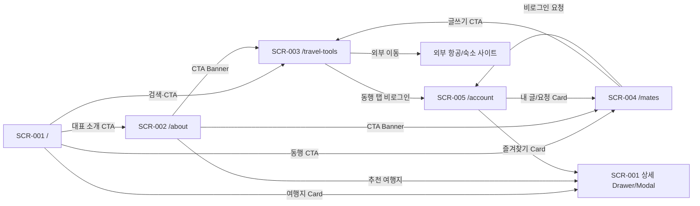

# Free Traveler — UI/UX Plan

**Document ID:** UIUX-TRAVEL-001
**기반 문서:** `01_PRD.md`, `02_SRS_BASELINE.md`, `PROJECT_SCOPE.md`, `03_UI_COVERAGE_ANALYSIS.md`, `design-reference/vendor/airbnb/DESIGN-airbnb.md`
**작성일:** 2026-09-10
**상태:** UI/UX Design Baseline (5 Screens)

---

## 1. 문서 목적과 참고 방식

이 문서는 `03_UI_COVERAGE_ANALYSIS.md`가 확정한 5개 디자인 Screen(SCR-001~SCR-005)에 실제 화면 구성을 배치한다. Airbnb 디자인 분석 문서(`DESIGN-airbnb.md`)는 **레이아웃 원리와 컴포넌트 사고방식만 참고**한다: 사진 중심의 넓은 여백, 카드 1개 그림자 톤만 쓰는 절제된 elevation, pill/round 형태의 부드러운 형태 언어, 섹션마다 목적이 분명한 밀도 조절. Airbnb 고유의 상표 요소(Rausch `#ff385c`, Airbnb Cereal 폰트, "Guest favorite"·"NEW" 배지, 로고, 3-product 내비게이션 구조)는 사용하지 않으며, 색상·폰트·컴포넌트 이름은 Free Traveler 고유 값으로 새로 정의한다.

이 문서는 디자인 계획서이며 실제 구현 코드를 포함하지 않는다.

---

## 2. 브랜드 및 공통 디자인 시스템

### 2-1. 브랜드 원칙

| 항목 | 정의 |
|---|---|
| 브랜드명 | Free Traveler |
| 톤 | 여행 준비를 돕는 신뢰형 가이드. 화려한 마케팅보다 정보의 명확성과 안전 고지를 우선한다 |
| 배경 | 흰색(Canvas) 기본, 카드도 흰색 위주로 사진과 텍스트의 대비로 위계를 만든다 |
| 텍스트 | 짙은 회색(순수 검정 아님) |
| 포인트 색 | 코랄 1색을 CTA·활성 상태·브랜드 강조에만 제한적으로 사용한다 |
| 경고·안전 | 코랄과 색상 계열이 다른 semantic color로 분리해 "지금 눌러야 하는 것"과 "위험/경고"를 시각적으로 혼동하지 않게 한다 |

### 2-2. 색상 토큰

| 토큰 | 값 | 용도 |
|---|---|---|
| `color.canvas` | `#FFFFFF` | 페이지 기본 배경 |
| `color.surface-soft` | `#F7F6F4` | 섹션 배경 교차, 비활성 필드 |
| `color.surface-card` | `#FFFFFF` | 카드 배경 |
| `color.ink` | `#23262B` | 헤드라인·본문 텍스트(순수 검정 아님) |
| `color.body` | `#4A4E56` | 본문 단락, 설명 문장 |
| `color.muted` | `#767B84` | 캡션, 보조 라벨, 비활성 텍스트 |
| `color.hairline` | `#E4E6E9` | 카드 테두리, 구분선 |
| `color.coral` (Primary) | `#F2613B` | Primary CTA, 활성 탭, 브랜드 강조 링크 |
| `color.coral-active` | `#D24E2B` | Primary 버튼 press 상태 |
| `color.coral-tint` | `#FDE3D8` | Primary 버튼 disabled, 선택 Chip 배경 |
| `color.on-coral` | `#FFFFFF` | 코랄 배경 위 텍스트 |
| `color.danger` | `#C23B2E` | 폼 오류, 신고 경고, 중대 여행경보 |
| `color.danger-bg` | `#FBEAE7` | 오류/경고 배지·배너 배경 |
| `color.warning` | `#9C6B14` | 안전정보 최신성(stale) 경고, 주의 배지 |
| `color.warning-bg` | `#FBF1DE` | 경고 배지·배너 배경 |
| `color.success` | `#1E7A50` | 성공 완료 상태(요청 승인, 제출 완료) |
| `color.success-bg` | `#E7F5EE` | 성공 배지 배경 |
| `color.focus-ring` | `#1D4ED8` | 키보드 포커스 아웃라인 전용(다른 의미로 재사용하지 않음) |

> 오류(`danger`)는 빨강 계열, 경고/안전정보(`warning`)는 호박색 계열로 분리해 코랄(주황빛 산호색)과 육안으로 구분되도록 한다.

### 2-3. 타이포그래피

- 폰트 스택: `"Inter", -apple-system, BlinkMacSystemFont, "Apple SD Gothic Neo", "Malgun Gothic", system-ui, sans-serif`
- 라틴 문자와 숫자는 Inter, 한글 본문은 시스템 한글 폰트(macOS: Apple SD Gothic Neo, Windows: Malgun Gothic)로 자연스럽게 대체된다.

| 토큰 | Desktop 1440px | Mobile 390px | 굵기 | 용도 |
|---|---|---|---|---|
| `type.display-xl` | 40px / 1.2 | 28px / 1.25 | 700 | SCR-001·SCR-002 Hero 헤드라인 |
| `type.display-lg` | 32px / 1.25 | 24px / 1.3 | 700 | Section 제목 |
| `type.title` | 20px / 1.3 | 18px / 1.35 | 600 | 카드 제목, 탭 라벨 |
| `type.body` | 16px / 1.6 | 15px / 1.6 | 400 | 본문·설명 문장 |
| `type.body-sm` | 14px / 1.5 | 14px / 1.5 | 400 | 카드 메타, 캡션 |
| `type.button` | 16px / 1.25 | 16px / 1.25 | 600 | 버튼 라벨 |
| `type.badge` | 12px / 1.3 | 12px / 1.3 | 600 | 상태 배지, Chip |

### 2-4. 레이아웃 기준

| 항목 | Desktop (1440px) | Mobile (390px) |
|---|---|---|
| 콘텐츠 최대 폭 | 1200~1280px, 중앙 정렬, 좌우 여백 최소 80px | 100% 폭, 좌우 여백 20px |
| Section 상하 여백 | 64~96px | 40~64px |
| Card Grid | 3~4열 | 1열 |
| Card 간격 | 24px | 16px |
| Hero 높이 | 화면 전체 높이를 채우지 않고, 1440px 화면에서 다음 Section 시작부가 보이도록 480~620px 내외로 제한 | 콘텐츠 기준 자동 높이(과도한 여백 없이) |

### 2-5. 형태·컴포넌트 언어

| 컴포넌트 | 규칙 |
|---|---|
| Radius | 버튼/인풋 8px, 카드 14px, Chip·배지 9999px(pill) |
| Elevation | 기본은 그림자 없음(hairline 테두리로 구분). 카드 hover/Drawer/Dropdown에만 1단계 그림자(`0 2px 6px rgba(0,0,0,.06), 0 1px 2px rgba(0,0,0,.08)`) 적용 |
| 버튼 | Primary(코랄 배경), Secondary(흰 배경+ink 1px 테두리), Text(배경 없음, 밑줄 hover) |
| 터치 영역 | 모든 인터랙션 요소 최소 44×44px 확보(모바일 탭·버튼·아이콘 버튼 포함) |
| 포커스 | 모든 인터랙션 요소에 `focus-visible` 시 2px `color.focus-ring` 아웃라인, 배경색으로 대체하지 않음 |
| 이미지 | 인터넷 이미지 URL 사용, 실제 장소·상황을 설명하는 대체텍스트 필수(예: "제주 성산일출봉 전경과 유채꽃밭") |

---

## 3. 공통 Header / Footer

5개 Screen 전체가 동일한 Header/Footer를 공유한다(REQ-FUNC-064, 065).

### Header

| 영역 | Desktop | Mobile |
|---|---|---|
| 좌측 | Free Traveler 로고(텍스트 워드마크) → `/` 이동 | 동일 |
| 중앙 | 주요 내비게이션: 여행지(홈 내 앵커), 여행 준비(`/travel-tools`), 동행 찾기(`/mates`), 대표 소개(`/about`) | 햄버거 메뉴로 축소 |
| 우측 | 로그인 전: `로그인` 텍스트 버튼 + `/account`로 이동하는 `가입하기` Primary 버튼. 로그인 후: 닉네임 + 아바타(클릭 시 `/account`) | 동일 항목을 햄버거 메뉴 내부에 배치 |
| 높이 | 72px, 흰 배경, 하단 1px hairline | 60px |

### Footer

| 영역 | 내용 |
|---|---|
| 컬럼 1 | Free Traveler 소개 한 줄 + `/about` 링크 |
| 컬럼 2 | 서비스: 여행지, 여행 준비, 동행 찾기 |
| 컬럼 3 | 안전·정책: 이용약관, 개인정보 처리방침, 동행 안전수칙, 콘텐츠 면책 안내 |
| 컬럼 4 | 문의·SNS 링크(관리 데이터 기반) |
| 하단 바 | 저작권 문구 + "외부 예약 사이트 이용 시 조건은 해당 사이트를 따릅니다" 고지 |
| Mobile | 4컬럼 → 1컬럼 아코디언 |

---

## 4. 콘텐츠 밀도·Section 배치 원칙

- 모든 Screen은 Header와 Footer 사이에 목적이 명확한 Section을 순서대로 배치하며, Section 수는 SCR-001·SCR-002 각 7개, SCR-003·SCR-004 각 6개를 기본으로 한다.
- 각 Section은 제목 1개, 1~3문장의 자연스러운 한국어 설명, 그리고 실제 콘텐츠 또는 명확한 CTA를 반드시 포함한다.
- Section 유형은 Hero, Card Grid, 좌우 분할, Chip 목록, 3단계 안내, CTA Banner를 교차 배치해 같은 유형이 화면 전체를 지배하지 않도록 한다.
- Hero는 화면 전체 높이를 차지하지 않으며, 1440px 데스크톱 기준 다음 Section의 상단이 보이는 높이로 제한한다.
- 데이터가 없는 상태에서도 "왜 비어 있는지 + 무엇을 하면 되는지 + 다음 행동 CTA"를 함께 보여줘 빈 화면처럼 느껴지지 않게 한다.
- `Lorem ipsum`, `준비 중`, `정보 확인 필요` 같은 의미 없는 자리표시자와 근거 없는 빈 카드·과도한 여백을 두지 않는다.

---

## 5. SCR-001 `/` 메인

### 목적
국내·해외 여행지를 탐색하고, 여행 동기를 발견하고, 해외 국가의 안전정보를 확인한 뒤 `/travel-tools`·`/mates`·`/about`으로 자연스럽게 이동한다.

### Section 구성 (7개)

| # | 제목(예시) | 유형 | 설명 문장(예시) | 콘텐츠 / CTA | 연결 요구사항 |
|---|---|---|---|---|---|
| 1 | "어디로 떠나든, 준비는 여기서 시작하세요" | Hero | "국내외 여행지를 검색하고, 항공·숙소 조건 정리부터 동행 찾기까지 한 곳에서 진행하세요." | 검색창(여행지명·국가·테마) + Primary CTA "여행 준비 시작하기"(`/travel-tools`) | REQ-FUNC-001, 003, 064 |
| 2 | "지금 인기 있는 국내 여행지" | Card Grid (6) | "가까운 국내 여행지 6곳을 먼저 소개합니다. 카드를 선택하면 상세 정보를 바로 볼 수 있어요." | 서울·부산·제주 등 6개 Card(대표 이미지+alt, 테마 Chip, "자세히 보기") → 선택 시 같은 화면 상세 Drawer | REQ-FUNC-001, 002, 004, 007 |
| 3 | "지금 인기 있는 해외 여행지" | Card Grid (6) | "일정을 정하기 전에 도쿄, 방콕 같은 해외 인기 도시의 핵심 정보를 먼저 확인해 보세요." | 6개 Card(국가/도시, 이미지+alt, 안전정보 배지) → 상세 Drawer, Drawer 내 안전정보 탭 연결 | REQ-FUNC-001, 004, 006 |
| 4 | "어떤 여행을 원하세요?" | Chip 목록 (6) | "테마와 계절로 여행지를 다시 좁혀볼 수 있습니다. 원하는 항목을 선택하면 목록이 즉시 바뀝니다." | 휴양/도시/자연/미식/가족/저예산 등 6개 Chip → 클릭 시 2·3번 목록 필터링 | REQ-FUNC-002 |
| 5 | "출발 전 꼭 확인할 국가별 주의사항" | Card Grid (6) | "치안, 법규, 재난·보건 정보를 국가별로 정리했습니다. 출국 전 최신 확인일을 함께 확인하세요." | 국가 6개 Card(경보 단계 라벨, 최종 확인일, stale 배지 조건부) → 선택 시 안전정보 Drawer | REQ-FUNC-006, 047, 048, 050, 051 |
| 6 | "최근 올라온 동행 모집" | Card 목록(최대 3) 또는 Empty State | "함께 떠날 동행을 찾고 있다면 최근 모집 중인 글을 확인해 보세요." (데이터 없을 시: "아직 등록된 동행 모집글이 없습니다. 가장 먼저 글을 남겨보세요.") | 최근 3개 Card(국가·기간·모집 인원) → `/mates`. 데이터 없으면 이용 방법 3줄 + "동행글 작성하기" CTA(`/travel-tools` 동행 탭) | REQ-FUNC-030, 031, 회원가입 유도(REQ-FUNC-066) |
| 7 | "여행을 큐레이션하는 사람, free_traveler" | 좌우 분할 | "50회 이상의 자유여행과 30개국 이상의 경험을 바탕으로 여행지를 소개합니다." | 좌측 대표 이미지, 우측 `50+ Trips`/`30+ Countries` 수치 + 한 줄 철학 + "대표 소개 보러 가기" CTA(`/about`) | REQ-FUNC-057, 058 |

### 여행지 상세 Drawer/Modal

- 트리거: 2·3·5번 Section의 Card 선택.
- 구성: 대표 이미지(alt), 소개(300자 이상), 명소 5개 이상, 추천 시기, 1일/3일 일정, 예산, 교통, 음식 3개 이상, 에티켓 3개 이상, 출처·수정일, 해외일 경우 "국가 안전정보 보기" 하위 탭.
- 안전정보 하위 탭: 8개 카테고리, 경보 범위, 긴급연락처, MOFA 원문 링크(새 탭), 7일 초과 시 "최신 정보 재확인 필요" 경고 배지(`color.warning`).
- Desktop: 화면 우측에서 슬라이드인하는 Drawer(폭 480px). Mobile: 전체 화면 Modal, 상단 닫기 버튼.

### 상태

| 상태 | 적용 위치 | 표현 |
|---|---|---|
| Loading | 2·3·5번 Card Grid, Drawer 최초 진입 | Card 자리에 스켈레톤 블록(텍스트 아님) |
| Success | 전 Section | 정상 데이터 렌더 |
| Empty | 4번 Chip 필터 결과 0건, 6번 동행글 없음 | 조건 완화 안내+초기화(필터), 이용 방법+작성 CTA(동행글) |
| Error | Drawer 데이터 로드 실패, 안전정보 원문 링크 접속 실패 | 인라인 오류 문장 + 다시 시도 버튼, Drawer는 닫지 않음 |

---

## 6. SCR-002 `/about` 대표 소개

### 목적
`free_traveler`의 경험과 기준을 확인해 사이트 콘텐츠의 신뢰도를 판단하고, 자연스럽게 여행 준비·동행 찾기로 이동한다.

### Section 구성 (7개)

| # | 제목(예시) | 유형 | 설명 문장(예시) | 콘텐츠 / CTA | 연결 요구사항 |
|---|---|---|---|---|---|
| 1 | "50번의 자유여행, 30개국의 기록" | Hero | "free_traveler는 직접 다녀온 여행만을 바탕으로 여행지를 소개합니다." | 대표 이미지(alt) + 한 줄 소개 문장, 스크롤 유도 화살표 | REQ-FUNC-057, 061 |
| 2 | "숫자로 보는 여행 이력" | 지표 강조 Section | "지금까지의 여행 경험을 숫자로 정리했습니다." | `50+ Trips`, `30+ Countries`, 방문 대륙 수 등 3개 수치 카드 | REQ-FUNC-057 |
| 3 | "왜 여행을 기록하기 시작했을까" | 좌우 분할 | "첫 자유여행부터 지금까지의 계기와 여행을 대하는 태도를 소개합니다." | 좌측 사진, 우측 자기소개·계기·철학 2~4개 문단 | REQ-FUNC-058 |
| 4 | "여행의 흐름을 담은 타임라인" | 타임라인 | "연도별로 어떤 지역을 어떻게 여행했는지 확인할 수 있습니다." | 6개 이상 시점 카드(연도, 장소, 요약 한 줄) | REQ-FUNC-060 |
| 5 | "지금까지 다녀온 30개국" | Chip/목록 (권역별) | "아시아, 유럽, 북미, 오세아니아 등 권역별로 방문 국가를 모아봤습니다." | 권역 탭 또는 그룹 헤더 + 국가 Chip 30개 이상 | REQ-FUNC-059 |
| 6 | "카메라에 담은 여행의 순간들" | Card Grid(Gallery, 8장 이상) | "서로 다른 도시와 계절에서 찍은 사진을 모았습니다." | 8장 이상 사진 Card, 각 이미지에 장소를 설명하는 alt | REQ-FUNC-061 |
| 7 | "다시 가고 싶은 여행지 4곳" | Card Grid + CTA Banner | "직접 다녀온 곳 중 가장 자주 추천하는 여행지 4곳입니다." | 4개 Card(→ SCR-001 상세 Drawer로 이동) + 하단 CTA Banner "여행 준비 시작하기"(`/travel-tools`), "동행 찾아보기"(`/mates`) | REQ-FUNC-063 |

### 상태

| 상태 | 적용 위치 | 표현 |
|---|---|---|
| Loading | 페이지 최초 진입 | 전체 스켈레톤(Hero 이미지 블록 우선 표시) |
| Success | 전 Section | 정상 데이터 렌더(정적 데이터이므로 대부분 이 상태) |
| Error | 이미지 로드 실패 | 이미지 자리에 중립 플레이스홀더 + alt 텍스트는 유지 |

> 대표 소개는 정적 콘텐츠이므로 Empty·Unauthorized 상태는 정의하지 않는다.

---

## 7. SCR-003 `/travel-tools` 통합 여행 준비

### 목적
항공·숙소 조건을 입력·검증·요약한 뒤 외부 사이트로 이동하거나, 동행 모집글을 작성한다. 세 탭(항공편/숙소/동행 구하기)의 입력·검증·완료 상태는 서로 독립적으로 유지한다.

### Section 구성 (6개, 탭 전환과 무관한 공통 Section 4개 + 동행 탭 전용 1개)

| # | 제목(예시) | 유형 | 설명 문장(예시) | 콘텐츠 / CTA | 연결 요구사항 |
|---|---|---|---|---|---|
| 1 | "여행 준비, 순서대로 정리해 보세요" | Intro | "국가·기간을 먼저 정리하면 항공·숙소 검색이나 동행 모집글 작성이 훨씬 수월합니다." | 3줄 이용 순서 설명(조건 입력 → 요약 확인 → 외부 이동 또는 동행 모집) | 전체 흐름 안내 |
| 2 | 탭 전환 영역 | 탭(항공편 / 숙소 / 동행 구하기) | 탭 상단 캡션: "원하는 준비 항목을 선택하세요." | 탭 3개, 각 탭은 독립된 입력·상태를 가짐 | REQ-FUNC-011, 019, 031 |
| 3 | "국가·지역·날짜를 입력하세요" | Form | "정확한 조건을 입력하면 다음 단계에서 요약을 확인할 수 있습니다." | 항공: 국가·지역·출발일·귀국일 / 숙소: 국가·지역·체크인·체크아웃 — 필드별 오류 메시지 포함 | REQ-FUNC-011~013, 019~021 |
| 4 | "입력한 조건을 확인하세요" | 좌우 분할(요약 + Action Card) | "아래 내용이 맞다면 외부 사이트에서 항공편·숙소를 찾아보세요." | 좌측 요약 카드(국가/지역/날짜), 우측 Action Card: "항공편 보러 가기"/"호텔 보러 가기" 버튼(새 탭) | REQ-FUNC-014, 016, 022, 024 |
| 5 | "이용 전에 알아두세요" | 3단계 안내 | "외부 이동 전에 아래 3가지를 확인해 주세요." | ① 입력값은 외부 사이트로 전달되지 않습니다 ② 실제 가격·예약 가능 여부는 이동한 사이트에서 확인하세요 ③ 이동 후에도 이 페이지의 입력값은 유지됩니다 | REQ-FUNC-015, 017, 023, 025 |
| 6 | "함께 떠날 동행을 찾고 있나요?" | Form 또는 CTA(로그인 안내) | 비로그인/미성년: "동행 모집글 작성은 성인 인증 후 이용할 수 있습니다." / 로그인+인증 완료: "모집 조건과 안전수칙을 확인하고 글을 남겨보세요." | 비로그인: 안내 문구 + "로그인/가입"(`/account`) CTA. 로그인 시: 동행글 작성 Form(제목·국가·지역·기간·인원·조건·설명·안전수칙 동의) + 공개 연락처 작성 금지 안내 | REQ-FUNC-027, 028, 031, 032, 080 |

### 상태

| 상태 | 적용 위치 | 표현 |
|---|---|---|
| Loading | 외부 이동 버튼 클릭 직후(새 탭 오픈 대기) | 버튼 스피너, 페이지 자체는 유지 |
| Success | 3번 Form 검증 통과 후 4번 요약 표시, 6번 모집글 제출 완료 | 요약 카드 표시 / 제출 완료 토스트 |
| Error | 날짜 검증 실패(13, 21), 외부 URL 미설정(18, 26), 공개 연락처 탐지(32) | 필드 인라인 오류 또는 Section 상단 오류 배너(`color.danger`) |
| Unauthorized | 6번 탭에서 비로그인/성인확인 미완료 상태로 작성 시도 | Form 대신 안내 카드 + `/account` 이동 CTA |

---

## 8. SCR-004 `/mates` 동행 조회

### 목적
조건에 맞는 동행 모집글을 찾아 참가를 요청하거나, 본인 모집글의 요청을 처리한다.

### Section 구성 (6개)

| # | 제목(예시) | 유형 | 설명 문장(예시) | 콘텐츠 / CTA | 연결 요구사항 |
|---|---|---|---|---|---|
| 1 | "믿을 수 있는 동행을 찾아보세요" | Intro | "성인 인증을 마친 회원만 글을 쓰고 참가를 요청할 수 있어 더 안전합니다." | 안내 문장 + "새 동행글 작성하기" CTA(`/travel-tools` 동행 탭) | REQ-FUNC-027, 028 |
| 2 | "조건으로 찾아보세요" | Filter | "국가, 기간, 모집 상태로 원하는 동행을 좁혀보세요." | 국가·지역·기간·연령대·성별·스타일·모집상태 필터 + 결과 개수 요약 | REQ-FUNC-030 |
| 3 | "모집 중인 동행글" | Card Grid(최대 8, 우선 노출) | "조건에 맞는 모집글을 최대 8개까지 먼저 보여드립니다." | Card(제목, 국가·기간, 모집 인원, 스타일 Chip, 모집중/마감 배지) → 선택 시 상세 패널 | REQ-FUNC-030, 033, 037 |
| 4 | 상세 패널 | 좌우 분할(Desktop) / Drawer(Mobile) | "글 내용을 확인하고 참가를 요청해 보세요." | 좌: 목록 유지, 우: 상세(설명, 작성자 닉네임·스타일, 참가 요청 폼, 작성자 뷰에서는 요청 목록·승인/거절·마감/수정/삭제) | REQ-FUNC-033, 034, 035, 036, 038 |
| 5 | "참가 요청은 이렇게 진행돼요" | 3단계 안내 | "연락처 없이도 안전하게 첫 연결을 만들 수 있습니다." | ① 참가 메시지 작성·제출 ② 작성자 승인 대기(PENDING) ③ 승인 시 내 활동에서 확인 | REQ-FUNC-034, 036, 043 |
| 6 | "안전한 만남을 위한 약속" | CTA Banner | "불편한 상황이 있다면 신고와 차단 기능을 이용해 주세요." | 신고·차단 방법 요약 + "여행 조건 다시 정리하기" CTA(`/travel-tools`) | REQ-FUNC-039, 040, 080 |

### 상태

| 상태 | 적용 위치 | 표현 |
|---|---|---|
| Loading | 3번 목록, 4번 상세 패널 | 스켈레톤 Card, 상세 패널 스켈레톤 |
| Success | 목록·상세 정상 표시, 참가 요청 제출 완료 | 정상 렌더, 제출 완료 토스트 |
| Empty | 2·3번 필터 결과 0건 | "조건에 맞는 동행글이 없습니다" + 필터 초기화 버튼 + "새 글 작성하기" CTA + 이용 방법 요약 |
| Error | 중복 참가 요청(35), 신고 제출 실패 | 인라인 오류 배너(`color.danger`) |
| Unauthorized | 비로그인 상태에서 참가 요청·글쓰기 시도 | 안내 카드 + `/account` 이동 CTA |

---

## 9. SCR-005 `/account` 계정·관리

### 목적
로그인/가입/성인확인 후 본인 프로필과 활동(글·요청·즐겨찾기·차단)을 관리하고, 관리자 권한이 있는 계정은 신고 상태와 외부 URL을 설정한다. 역할에 없는 탭은 렌더링하지 않는다.

### 역할별 탭 구성

| 역할 | 노출 탭 |
|---|---|
| Guest(비로그인) | 계정 안내(Intro), 로그인, 가입, 비밀번호 재설정 |
| Adult Member | 프로필·성인확인 요약, 내 활동(내 글/참가요청/즐겨찾기/차단 목록) |
| Admin | 관리자(신고 상태 처리, 외부 URL 설정) — 위 Member 탭에 추가로 노출 |

### 9-1. Guest 화면

| Section | 유형 | 설명 문장(예시) | 콘텐츠 |
|---|---|---|---|
| 계정 기능 Intro | Intro | "로그인하면 여행지 즐겨찾기, 동행 모집글 작성, 참가 요청까지 이용할 수 있습니다." | 로그인 후 가능한 기능 3가지 요약 리스트 |
| 로그인 / 가입 / 비밀번호 재설정 Card | Form(탭 전환) | "이메일로 간편하게 가입하고 인증할 수 있습니다." | 이메일·비밀번호 입력, 유효성 오류 표시, 이메일 인증 안내 |
| 보안 안내 | 3단계 안내 | "가입 시 아래 절차로 안전하게 계정을 보호합니다." | ① 이메일 인증 ② 성인 확인(생년월일 미저장, 인증 여부만 기록) ③ 비밀번호는 안전하게 암호화 저장 | REQ-FUNC-028, 066 |

### 9-2. Adult Member 화면

| Section | 유형 | 설명 문장(예시) | 콘텐츠 |
|---|---|---|---|
| 프로필·성인확인 요약 | 좌우 분할 | "닉네임과 여행 스타일은 동행 모집글에 공개로 표시됩니다." | 닉네임, 연령대, 성별(선택), 여행 스타일, 성인확인 완료 배지, 수정 버튼 | REQ-FUNC-028, 029 |
| 내 모집글 | Card 목록 또는 Empty | "작성한 동행글의 상태와 요청 현황을 확인하세요." | 내 글 Card(상태 배지, 받은 요청 수) → SCR-004 상세로 이동, 없으면 "아직 작성한 글이 없습니다" + 작성 CTA | REQ-FUNC-036, 038 |
| 참가 요청 현황 | Card 목록 또는 Empty | "내가 보낸 요청의 승인 상태를 확인할 수 있습니다." | PENDING/ACCEPTED/REJECTED 배지 목록, 없으면 안내+"동행 찾아보기" CTA | REQ-FUNC-034, 043 |
| 즐겨찾기 여행지 | Card 목록 또는 Empty | "저장한 여행지를 다시 확인하고 바로 이동할 수 있습니다." | 즐겨찾기 Card → SCR-001 상세 Drawer, 없으면 "아직 즐겨찾기한 여행지가 없습니다" + `/` 이동 CTA | REQ-FUNC-068 |
| 차단 목록 | 목록 또는 Empty | "차단한 사용자와는 글·요청이 서로 노출되지 않습니다." | 차단 사용자 목록 + 해제 버튼, 없으면 "차단한 사용자가 없습니다" 안내 | REQ-FUNC-040 |
| 새 동행글 작성 CTA | CTA Banner | "새로운 동행을 찾고 있다면 지금 모집글을 남겨보세요." | "`/travel-tools`로 이동" 버튼 | REQ-FUNC-031 |

### 9-3. Admin 화면(Member 탭에 추가)

| Section | 유형 | 설명 문장(예시) | 콘텐츠 |
|---|---|---|---|
| 관리 Intro | Intro | "신고 처리와 외부 이동 링크 설정만 이 화면에서 관리합니다." | 관리자 권한 범위 안내(콘텐츠 편집·통계는 다루지 않음) |
| 신고 상태 변경 | Card 목록 또는 Empty | "접수된 신고를 확인하고 처리 상태를 변경하세요." | 신고 목록(대상·사유·접수일·상태), 상태 변경(OPEN→REVIEWING→RESOLVED/DISMISSED), 없으면 "접수된 신고가 없습니다" 안내 | REQ-FUNC-041 |
| 항공·숙소 외부 URL 설정 | Form | "허용된 HTTPS 주소만 저장할 수 있습니다." | 항공/숙소 URL 입력 필드, 저장 시 HTTPS·허용목록 검증, 실패 시 인라인 오류 | REQ-FUNC-077 |

### 상태

| 상태 | 적용 위치 | 표현 |
|---|---|---|
| Loading | 탭 전환, 목록 로딩 | 스켈레톤 Card/Form |
| Success | 로그인 완료, 프로필 저장, 신고 상태 변경, URL 저장 | 완료 토스트 |
| Empty | 내 글/요청/즐겨찾기/차단/신고 목록 0건 | 설명 문장 + 다음 행동 CTA(위 표에 명시) |
| Error | 로그인 실패, 유효성 오류, URL 허용목록 위반 | 인라인 오류 메시지(`color.danger`) |
| Unauthorized | 비로그인 상태로 Member/Admin 탭 접근 시도, Admin이 아닌 계정의 관리자 탭 접근 시도 | 탭 자체를 렌더링하지 않고 Guest 화면으로 대체, 직접 진입 시 "권한이 없습니다" 안내 + 로그인/홈 이동 CTA |

---

## 10. Screen 간 이동 맵

---

## 11. 검증 체크리스트

| 항목 | 확인 |
|---|---|
| Requirement 삭제 여부 | 없음 — `03_UI_COVERAGE_ANALYSIS.md`의 배치를 그대로 계승 |
| EXCLUDED 기능 임의 복원 여부 | 없음 — 통합검색(067), 콘텐츠 CMS(072), 감사 로그(076) 등 EXCLUDED 항목은 화면에 배치하지 않음 |
| 디자인 Screen 수 | 5개(SCR-001~005) 고정, 초과 없음 |
| SCR-001/002 Section 수 | 각 7개 |
| SCR-003/004 Section 수 | 각 6개 |
| Hero 전체 높이 차지 여부 | SCR-001·SCR-002 Hero 모두 480~620px로 제한, 1440px 화면에서 다음 Section 시작부 노출 |
| Section 유형 교차 사용 | Hero·Card Grid·좌우 분할·Chip 목록·3단계 안내·CTA Banner를 전 화면에 걸쳐 교차 배치 |
| 빈 문구·빈 카드 사용 여부 | `Lorem ipsum`, `준비 중`, `정보 확인 필요` 미사용, 모든 Empty State에 설명+행동 CTA 포함 |
| 이미지 alt 원칙 | 모든 예시 이미지에 실제 장소를 설명하는 alt 문구 지정 |
| Header/Footer 공통 사용 | 5개 Screen 전체에 동일 구조 적용 |
| 키보드 포커스·터치 영역 | 포커스 링 토큰, 44px 최소 터치 영역 규칙을 2-5절에 명시 |
| 코랄과 semantic color 구분 | `color.coral`과 `color.danger`/`color.warning`/`color.success`를 다른 색상 계열로 정의 |
| Dashboard/통계 화면 존재 여부 | 없음 — SCR-005 Admin 영역도 목록형 신고 처리·URL 설정만 포함 |
